# Vanillie - For a pleasent minecraft server experience

❤︎ Vanillie is a personal project for a cozy minecraft server with friends.
However it can be used by anyone! ❤︎

(´｡• ᵕ •｡`) ♡

** *

### Quick Info
* **Plugin Version:** `v1.7`
* **Intended Game Version:** `26.2`
* **Language Support:** Currently only German (*Customize every text via `lang.json`*)
* **Approach:** Clean and simple UI, that is super user-friendly

** *

### Setup Guide
#### Compile from scratch
1. Download the repository and extract it
2. Run gradle and build the plugin from source with `.\gradlew build` in the root directory
3. Copy the file called `Vanillie-X.X.jar` from the `build/libs/` directory into your servers plugin folder
#### Download the prebuilt binary
1. Download the newest `Vanillie-X.X.jar` from the releases list (the texture pack is not needed)
2. Place it inside your servers plugin folder

** *

# Features
**Click on the text to jump to a longer explanation!**

| Feature                                                                                 | Images                                                                                                                                                                                  |
|:----------------------------------------------------------------------------------------|:----------------------------------------------------------------------------------------------------------------------------------------------------------------------------------------|
| [Enderman dont place blocks](#enderman-stop-placing-blocks)                             | :D                                                                                                                                                                                      |
| [Change biomes with a wand](#biomewand)                                                 | 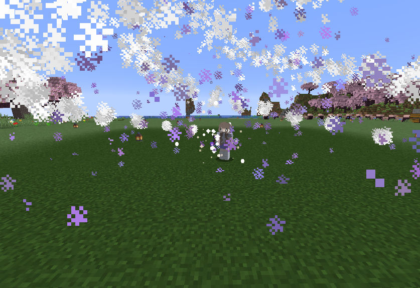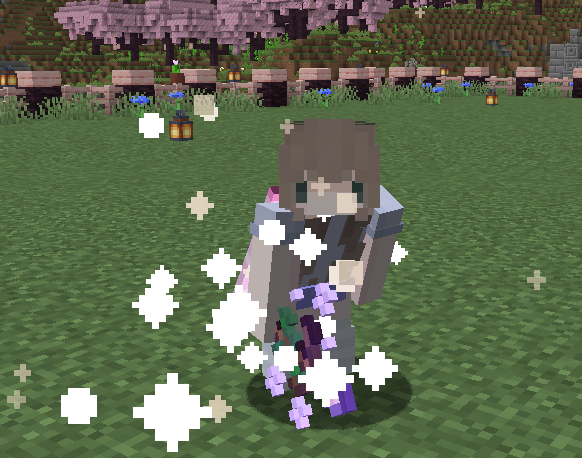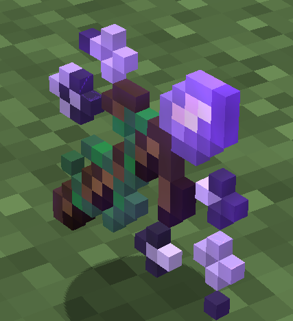 |
| [Create, reorder custom colored tags next to your name](#tag---custom-prefixes)         | 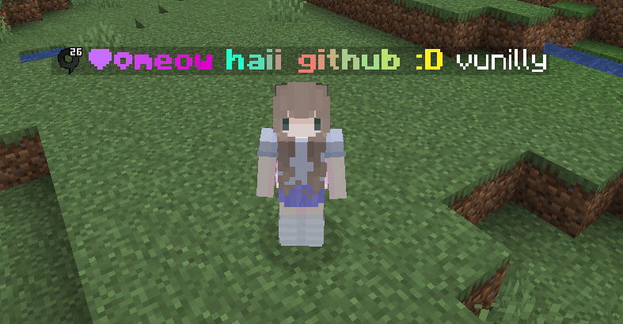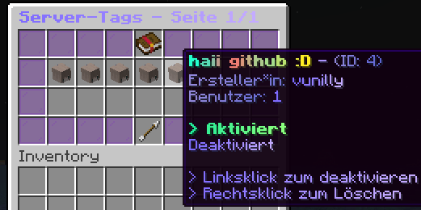                                                                        |
| [Vote to change the weather or time](#vote---weather-and-time-voting)                   | 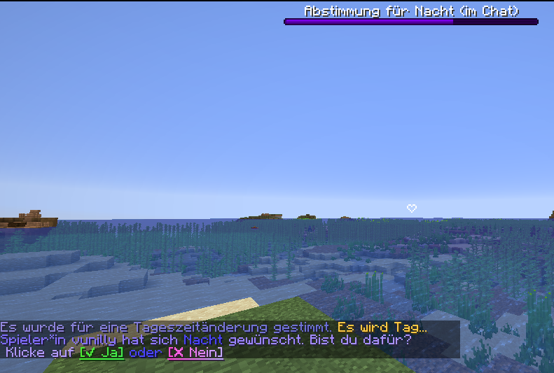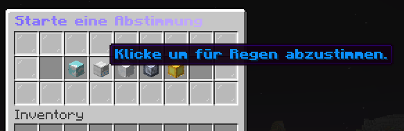                                                                  |
| [Activate a peaceful or fighting (pvp) mode](#pvp---toggle-pvp)                         | 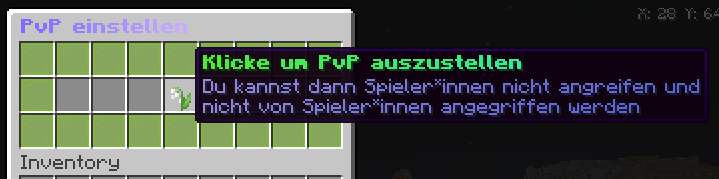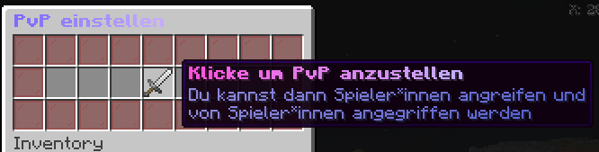                                                                          |
| [Change your players size](#size---change-player-model-size)                            | 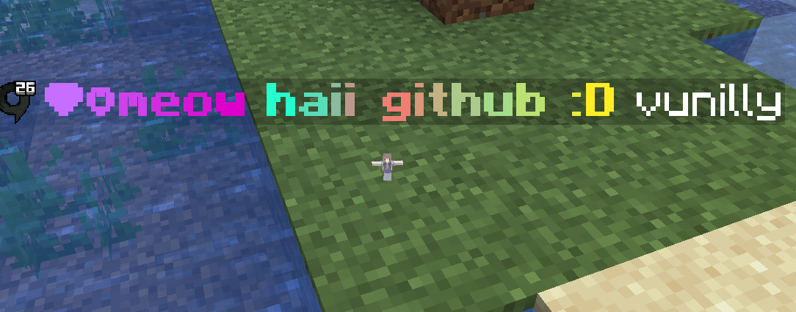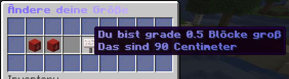                                                                       |
| [Notify others when you are live on Twitch](#twitch---connect-your-twitch-channel)      | 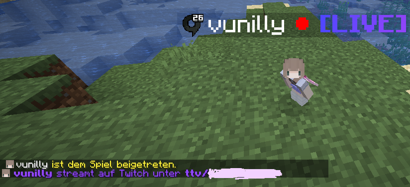                                                             |
| [See others inventory and enderchest](#stats---see-other-players-inventory--enderchest) | 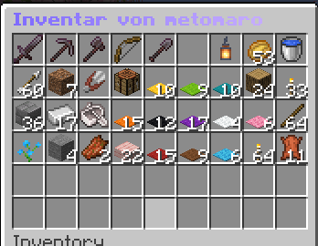                                                                               |
| [Restart Command to warn others before the server shuts down](#other-stuff)             |                                                                                                                                                                                         |

All features are integrated in a nice, clean and simple to use ui. The plugin is designed to be very user friendly.

## Enderman stop placing blocks
Enderman have been changed to not place down blocks, because it can get really anoying for many players.

## BiomeWand
A biomewand has been added that allows players to change the biome where they are, this is usefull for players who want
certain features like water color or grass color.
- Item is crafted from 1x Stick, 1x Diamond, 1x Amethyst Shard
- Has an animation and sound effects
- Rightclick opens a menu to choose what biome to place
- Leftclick will place the biome

## /tag - custom prefixes
You can create custom tags/prefixes, with a list of colors or your own colors.
- They can have gradients and symbols.
- Custom color support using Hex (`#ff0000` = red) Codes
- Each player can make 5 tags and use a maximum of 3
- A tag shows above the name and chat (For tablist, use the Placeholder Apis player team name)
- Players can change the order how they are shown

## /vote - weather and time voting
Players can start server-wide votes to change weather or time.
- Options: `Day`, `Night`, `Rain`, `Thunder`, `Clear Weather`
- Interactable buttons shown in chat and countdown is displayed in bossbar

## /pvp - toggle pvp
Switch to peaceful mode whenever you want to relax and build and turn PvP on when you want to fight
- Has a 60-second cooldown to be useable after being hit by a player
- In pacifist mode, you cannot deal or receive damage to other players
- Mobs (like zombies) can still attack you

## /size - change player model size
Players can change their ingame size
- Fun for hide and seek
- Maximum size is 3.0(~5 blocks) and minimum is 0.1(10cm)
- You are able to decrease your size in cm
- Cannot be changed when player has pvp cooldown

## /twitch - connect your twitch channel
Players can set a twitch username as theirs
- Players will receive a special tag if they are live on twitch
- A message will be broadcastet when they are live
- Players have to rejoin

## /stats - see other players inventory & enderchest
Players can see others inventory and enderchest.
Usage: `/stats <inventory|enderchest> <playername>`
- Item Names, Enchantments on Items and Durability are hidden
- Items can only ever be viewed, never removed
- Works with offline players

## Other stuff
- `/vanillieconfig` (or `/vconf` for short) - Reload configuration files
- - `clearconfig` - Clears all configurations to nothing
- - `reloadconfig` - Reloads all configurations from the files 
- - `saveconfig` - Saves current in memory data
- - `lang <filename>` - Loads a different file name for a lang, by default `en` and `de` are supported
- `/vanillie` - Shows plugin information and credits
- `/schedulerestart` - Schedules a shutdown with a message
- Join messages are changed